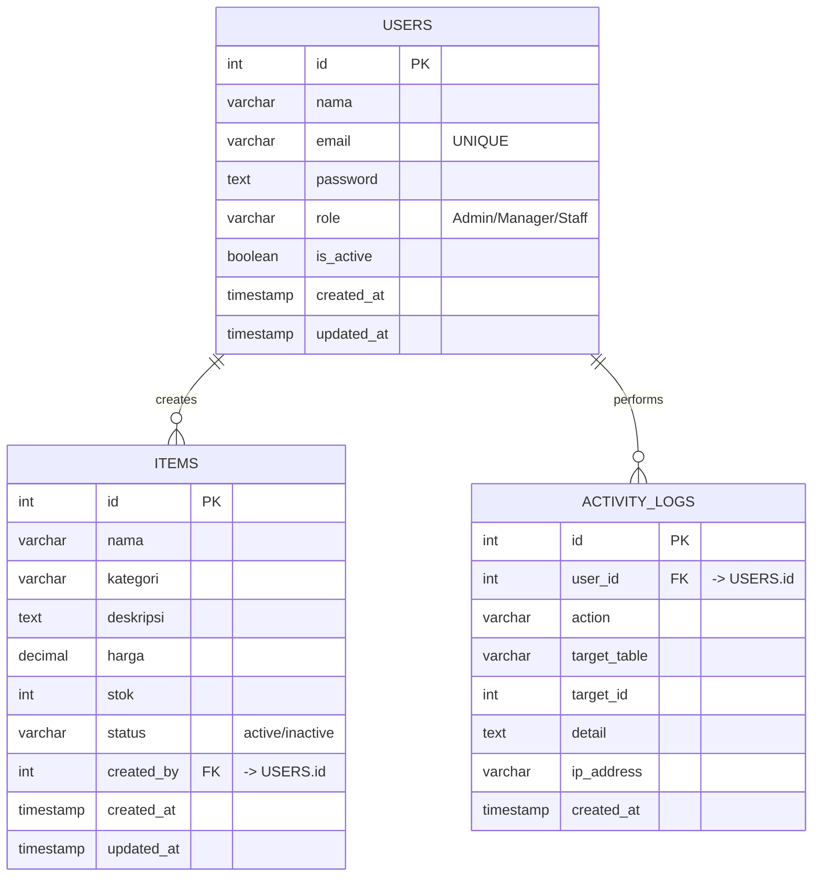

# Entity Relationship Diagram (ERD)

Sistem IMS menggunakan PostgreSQL dengan skema rasional sederhana namun kokoh, dirancang untuk mendukung fitur CRUD dan pencatatan aktivitas terpusat.

## Diagram ERD

## Deskripsi Tabel

### 1. Tabel `users`
Menyimpan informasi autentikasi dan profil pengguna.
- `role` digunakan untuk otorisasi akses (Admin memiliki hak hapus, Manager memiliki hak edit/tambah, Staff hak baca).
- `is_active` digunakan untuk *soft-delete*.

### 2. Tabel `items`
Menyimpan data master inventaris/produk.
- Terhubung dengan `users` melalui kolom `created_by` untuk *tracking* siapa yang menambahkan item tersebut.
- `status` ('active' / 'inactive') digunakan untuk filter *soft-delete*.

### 3. Tabel `activity_logs`
Tabel riwayat untuk audit trail (Sistem Notifikasi/Riwayat Aktivitas).
- Mencatat aksi (`LOGIN`, `CREATE`, `UPDATE`, `DELETE`) dan merujuk ke tabel lain (`target_table` dan `target_id`).
- Digunakan untuk analitik di halaman Dashboard dan tabel timeline di halaman Riwayat Aktivitas.
